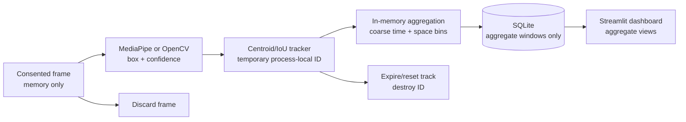

# Privacy-Conscious Face Analytics

[](https://github.com/jaeferys/privacy-conscious-face-analytics/actions/workflows/ci.yml)

A portfolio-ready retail and event analytics system that turns consented camera
frames into aggregate occupancy, flow, dwell, zone, and heatmap insights without
building an identity-recognition database.

The core privacy boundary is simple:

`frame -> detection -> ephemeral tracking -> aggregation -> frame and track discarded`

Raw frames remain in memory for the current operation. Geometry-only tracking
IDs exist inside one process session, expire when tracks time out, and are never
written to SQLite. The dashboard reads aggregate windows only.

This reduces retained data but does not guarantee anonymity, fairness, accuracy,
or legal compliance. Residual risks, dataset constraints, and evidence gaps are
documented rather than hidden.

## Why this project

Retail and event teams need answers such as:

- How busy is the space now, and when does traffic peak?
- How long do visitors dwell in aggregate?
- Which zones attract traffic?
- Where do coarse spatial heatmaps show congestion or engagement?

Those operational questions usually do not require names, face matching,
embeddings, demographic guesses, a face database, or cross-session
re-identification. This project demonstrates that narrower architecture.

## Portfolio differentiators

1. **Credible business use case:** occupancy, entries/exits, dwell distributions,
   zone engagement, time-of-day traffic, and heatmaps for stores and events.
2. **Privacy-by-design implementation:** volatile frames, replaceable
   identity-free detection, expiring geometry-only tracks, and aggregate-only
   SQLite storage.
3. **Honest evaluation:** tested precision/recall/F1 and condition-level
   robustness tooling, with real-world and demographic evidence gaps stated
   explicitly.

## Architecture



See [implemented architecture](docs/architecture.md) and the
[privacy and threat assessment](docs/privacy.md).

## Features

- Replaceable detector protocol with typed boxes, confidence, and relative
  geometry—no identity or embedding fields.
- Lazy MediaPipe detector on supported Python versions.
- OpenCV bundled Haar fallback for environments such as local Python 3.14 where
  MediaPipe wheels are unavailable.
- Webcam, explicit local-video, and generated in-memory frame sources.
- Geometry-only centroid/IoU tracking with configurable missed-frame and
  monotonic-time expiration.
- Occupancy, scene flow, dwell histogram, zone transitions/dwell, and normalized
  coarse heatmaps.
- Versioned, parameterized SQLite aggregate schema with deletion controls.
- Condition-aware evaluation from ignored local manifests.
- Recruiter-safe synthetic aggregate generator.
- Streamlit dashboard with no face, track, or trajectory views.
- Automated repository and schema privacy regression audit.

## Quick start: synthetic demo

Python 3.11 or 3.12 is recommended for MediaPipe. The rest of the project and
the OpenCV fallback also run on this workstation's Python 3.14.

```bash
python3 -m venv .venv
. .venv/bin/activate
python -m pip install -e ".[dev]"

face-analytics generate-synthetic \
  --db artifacts/analytics.sqlite3 \
  --windows 48 \
  --seed 7

face-analytics dashboard --db artifacts/analytics.sqlite3
```

Open `http://localhost:8501`. The dashboard visibly labels synthetic data and
requires no webcam, footage, dataset, or face image.

Clear generated rows:

```bash
face-analytics clear-aggregates --db artifacts/analytics.sqlite3
```

## Optional consented camera workflow

Only use a camera or local video when you have a lawful, documented consent and
retention basis. Keep all media outside Git.

Run the full volatile pipeline and persist one aggregate window:

```bash
face-analytics run-pipeline \
  --detector mediapipe \
  --webcam 0 \
  --max-frames 300 \
  --db artifacts/analytics.sqlite3
```

Or inspect detector throughput without tracking/storage:

```bash
face-analytics inspect-source \
  --detector mediapipe \
  --video /absolute/path/to/consented-video.mp4 \
  --max-frames 300
```

The project has no command that saves frames or face crops.

## Detection benchmark

Measure latency and throughput on generated blank frames:

```bash
face-analytics benchmark-detector --detector opencv-haar --frames 100
```

This is a performance smoke test, not an accuracy benchmark.

## Evaluation

The [evaluation framework](docs/evaluation.md) calculates precision, recall,
F1, latency, throughput, and metrics for supplied condition labels such as
easy/medium/hard, small faces, occlusion, pose, and lighting.

```bash
face-analytics evaluate \
  --manifest datasets/wider-face/validation.jsonl \
  --detector mediapipe \
  --output-prefix reports/evaluation/wider-face
```

No real-world face dataset was downloaded for this repository. Real detector
accuracy remains unmeasured. WIDER FACE is documented as a candidate, but its
image terms, provenance, consent implications, and repository suitability must
be reviewed before download. Demographic traits are never inferred, and
demographic fairness is not measured.

## Quality and privacy checks

```bash
pytest
ruff check .
ruff format --check .
mypy
python -m build
face-analytics privacy-audit \
  --root . \
  --db artifacts/privacy-audit.sqlite3
```

CI runs the same test, lint, format, type, build, CLI, and privacy checks.

## Data retained

| Data | In memory | SQLite | Git |
|---|---:|---:|---:|
| Current frame | Yes | No | No |
| Detection box/confidence | Yes | No | No |
| Temporary track ID/position | Yes | No | No |
| Aggregate occupancy/flow/dwell | Yes | Yes | No generated DB |
| Aggregate zone/heatmap bins | Yes | Yes | No generated DB |
| Synthetic/observed label | Yes | Yes | Source code only |
| Face crop or embedding | Never created | No | No |
| Identity/demographic label | Never created/inferred | No | No |

Run the full [privacy audit](docs/privacy.md) for requirement-to-test evidence.

## Project structure

```text
src/face_analytics/
├── analytics/       # transient aggregation, zones, heatmaps, models
├── dashboard/       # aggregate-only Streamlit app and pure transformations
├── demo/            # deterministic synthetic aggregate windows
├── detection/       # detector protocol, MediaPipe, OpenCV fallback
├── evaluation/      # condition-aware metrics and reports
├── storage/         # versioned aggregate-only SQLite repository
├── tracking/        # centroid/IoU ephemeral tracker
├── cli.py           # documented workflows
├── frame_sources.py # in-memory webcam/video/generated sources
├── pipeline.py      # end-to-end volatile vertical slice
└── privacy_checks.py

tests/               # deterministic functional and privacy evidence
docs/                # architecture, evaluation, privacy, demo, portfolio
scripts/             # standalone privacy scan
```

## Technology choices and tradeoffs

- **Python/OpenCV:** accessible computer-vision ecosystem and clear frame
  lifecycle; native packages require interpreter compatibility care.
- **MediaPipe:** lightweight preferred detector, but unavailable on Python 3.14
  at project time.
- **OpenCV Haar fallback:** no downloaded weights and works locally, but is a
  legacy detector with weaker expected robustness.
- **Centroid/IoU tracker:** transparent, deterministic, appearance-free, and
  easy to expire; less robust through long occlusion than ByteTrack.
- **SQLite:** inspectable and sufficient for a portfolio/demo; production
  concurrency, encryption, backups, and retention require deployment design.
- **Streamlit:** fastest path to an interview-ready aggregate dashboard; offers
  less custom UI control than a dedicated frontend.

## Limitations

- Entry/exit currently represents track lifecycle in one camera view, not a
  calibrated directional doorway crossing.
- No real-world detector accuracy or demographic fairness result is available.
- Geometry-only tracking can still link observations within a running session.
- Coarse aggregates reduce but do not eliminate time/location inference.
- Camera governance, runtime memory, logs, host security, access controls,
  backups, and legal assessment remain operator responsibilities.
- MediaPipe integration is CI-compatible on supported Python versions but was
  not executed locally on Python 3.14.

## Roadmap status

All eight planned build milestones are implemented and independently committed:
specification, detection, tracking, aggregation, evaluation, dashboard, privacy
architecture, and portfolio polish. A real dataset evaluation remains a
deliberate evidence gap pending terms and consent review.

See the [roadmap](docs/roadmap.md), [portfolio summary](docs/portfolio.md),
[walkthrough script](docs/demo-script.md), [recording instructions](docs/recording.md),
and [release checklist](docs/release-checklist.md).

## License

Project source code is released under the [MIT License](LICENSE). Datasets,
pretrained models, MediaPipe assets, OpenCV data, and other dependencies retain
their own licenses. The project license does not grant rights to third-party
images or datasets.
