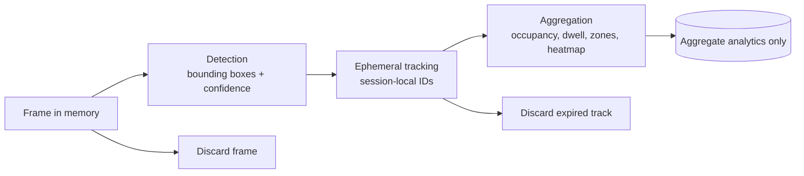

# Privacy-Conscious Face Analytics

[](https://github.com/jaeferys/privacy-conscious-face-analytics/actions/workflows/ci.yml)

A portfolio project for retail and event operators who need useful foot-traffic
and engagement signals without building an identity-recognition system.

The planned system processes camera frames in memory, detects visible people,
uses short-lived session-local tracks, and retains aggregate measurements such
as occupancy, dwell time, zone traffic, heatmaps, and time-of-day trends. Raw
frames and expired tracks are discarded. The project explicitly excludes face
matching, persisted face embeddings, identity labels, face databases, and
cross-session re-identification.

This approach reduces data collection but should not be described as anonymous
by default. Camera placement, source-footage consent and licensing, operational
access, aggregate retention, and small-group reporting can still create privacy
risks. Accuracy and fairness claims will be limited to measured results on
documented evaluation data.

## Project goals

- Give retail and event teams actionable aggregate traffic and engagement
  metrics.
- Demonstrate a privacy-by-design data lifecycle with narrow retention.
- Evaluate detector robustness and subgroup performance only where a licensed
  dataset provides ethically and legally appropriate labels.
- Produce a transparent, testable portfolio implementation with measured
  limitations.

## Data lifecycle



The required terminal flow is:

`frame -> detection -> ephemeral tracking -> aggregation -> frame and track discarded`

See [the architecture notes](docs/architecture.md) for trust boundaries and
retention rules.

## Current status

Step 1 establishes the specification, privacy boundaries, architecture, and
minimal Python scaffold. No detector, tracker, analytics database, dashboard,
or dataset is included yet.

| Step | Deliverable | Status |
|---|---|---|
| 1 | Specification and scaffold | Complete |
| 2 | Replaceable detection pipeline | Not started |
| 3 | Ephemeral tracking | Not started |
| 4 | Aggregate analytics | Not started |
| 5 | Fairness and robustness evaluation | Not started |
| 6 | Privacy-safe dashboard | Not started |
| 7 | Privacy architecture write-up | Not started |
| 8 | Portfolio polish | Not started |

Future steps require explicit approval and are tracked in
[the roadmap](docs/roadmap.md).

## Development

The stack is Python 3.11+, OpenCV, MediaPipe where supported, SQLite,
Streamlit, pytest, Ruff, and mypy. MediaPipe currently lacks Python 3.14 wheels,
so its integration is optional on that interpreter and exercised in CI on a
supported Python version.

Create an environment and install the project:

```bash
python3 -m venv .venv
. .venv/bin/activate
python -m pip install -e ".[dev]"
```

Run the scaffold validation:

```bash
pytest
ruff check .
ruff format --check .
mypy
```

## Responsible use

This repository is intended for consented, lawful retail/event analytics
experimentation. Do not add production footage, face crops, embeddings,
identity labels, restricted datasets, or model weights to Git. Dataset
licensing, consent basis, retention, access controls, and evaluation limitations
must be documented before any demo input is adopted.

## License

Project source code is released under the [MIT License](LICENSE). Datasets,
pretrained models, and third-party dependencies retain their own licenses and
must be reviewed separately before use or redistribution.
