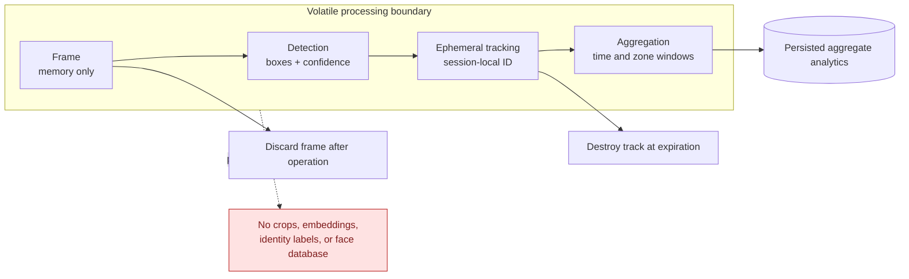

# Initial architecture and data flow

## Required lifecycle

`frame -> detection -> ephemeral tracking -> aggregation -> frame and track discarded`

## Component responsibilities

| Component | Receives | Emits | May persist |
|---|---|---|---|
| Frame source | Consented live/demo input | In-memory frame | Nothing |
| Detector | In-memory frame | Bounding boxes and confidence | Nothing |
| Ephemeral tracker | Current detections and volatile state | Session-local track events | Nothing |
| Aggregator | Track events and configured zones | Windowed aggregate metrics | Aggregate metrics only |
| Dashboard | Aggregate queries | Charts and summaries | Nothing beyond aggregate settings |

## Trust and retention boundaries

- The frame source, detector, and tracker are inside a volatile processing
  boundary. Logging and exception handling must not serialize their inputs.
- Tracking IDs exist only in process memory, are not globally unique, and are
  removed with expired track state.
- The persistence boundary accepts aggregate records only. It must reject image
  bytes, crops, embeddings, identity fields, and per-track histories.
- A later dashboard must query aggregates without exposing live or stored face
  imagery.
- Demo footage remains an unresolved dependency. Its license, consent basis,
  privacy implications, and repository suitability must be approved before use.

## Residual risks

This design minimizes persistence; it does not by itself guarantee anonymity or
legal compliance. Runtime compromise, overly granular aggregates, camera
placement, dataset provenance, operational access, and external data linkage
remain relevant. Each implementation step must test its own lifecycle boundary
and document limitations.
