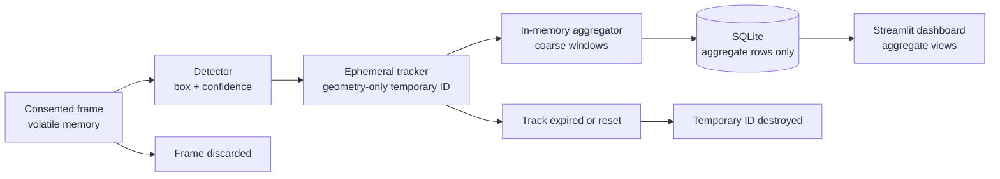

# Privacy architecture and threat assessment

## Scope and claim boundary

This project measures aggregate retail/event foot traffic and engagement. It is
temporary face detection and geometry-only within-session tracking, not facial
recognition. The design reduces retained personal data but does not establish
complete anonymity, legal compliance, or zero privacy risk.

## Implemented data lifecycle



The concrete flow is:

`frame -> in-memory detection -> ephemeral tracking -> aggregate calculation -> aggregate storage -> frame and temporary track discarded`

## Data classification

| Class | Examples | Lifecycle |
|---|---|---|
| Prohibited persistence | Frames, footage, face crops, embeddings, names, demographic guesses, identities, temporary IDs, trajectories | Never written by project code |
| Volatile processing | Current frame, detection boxes, confidence, temporary ID, centroid, first/last monotonic time | Process memory only; discarded after operation, expiration, or reset |
| Persisted aggregates | Windowed occupancy, entries, exits, dwell totals/histogram, zone totals, coarse heatmap, synthetic/observed label | SQLite with configurable deletion |
| External evaluation data | Licensed images and annotations supplied locally | Git-ignored; terms, consent, provenance, and retention require review |
| Operational configuration | Aggregate database path, coarse window/bin sizes | Safe placeholders only in `.env.example`; secrets are not required |

## What exists only in memory

- BGR frames in `frame_sources.py`, detector adapters, and evaluation runner.
- Bounding boxes and confidence in `Detection`.
- Temporary IDs and geometry state inside `EphemeralTracker`.
- Per-track zone membership inside `AggregateAnalytics`.

The detector API has no save method. The repository scan rejects `cv2.imwrite`,
`cv2.VideoWriter`, face-crop symbols, embedding-vector symbols, and persistent
track SQL patterns in implementation source.

## What is persisted

`AggregateStore` creates `schema_metadata` and `aggregate_windows`. The aggregate
table contains window timing, occupancy totals, scene flow, dwell totals and
histogram JSON, zone aggregate JSON, coarse heatmap JSON, and a
synthetic/observed label. It has no person, track, box, trajectory, image, path,
face, crop, identity, or embedding column.

Generated SQLite files live under ignored `artifacts/`. Use:

```bash
face-analytics clear-aggregates --db artifacts/analytics.sqlite3
```

Operational backups are outside this repository's control and require their own
retention and deletion policy.

## Track expiration

`EphemeralTracker` associates detections only through IoU and centroid distance.
Tracks expire after the configured missed-frame boundary or monotonic timeout.
`reset()` destroys all active state and resets the local ID sequence. A new
tracker starts empty and loads nothing from disk. SQLite and normal log output
never receive temporary IDs.

## Aggregation granularity

Windows cannot be shorter than 60 seconds; the default is five minutes.
Heatmaps use configurable coarse bins. Coarsening makes direct linkage more
difficult, but sparse locations, rare events, exact timestamps, or external
information can still enable inference. Deployments should apply minimum-count
suppression and choose granularity for expected traffic.

## Dataset consent and licensing

No face dataset is committed or automatically downloaded. WIDER FACE is
documented as a possible robustness benchmark, but its image terms,
redistribution rights, provenance, consent implications, and intended research
use must be reviewed before download. Evaluation data must remain under the
ignored `datasets/` directory.

Demographic inference is out of scope. The project does not infer gender, race,
ethnicity, age, emotion, or similar traits. Demographic fairness is not measured
because the selected candidate dataset does not provide an appropriate,
ethically grounded label basis.

## Threat boundaries and plausible misuse

| Threat or misuse | Current mitigation | Residual risk |
|---|---|---|
| Accidental frame/crop persistence | No write APIs; ignored sensitive paths; automated repository scan | Third-party libraries, operator changes, screenshots, or crash dumps |
| Turning tracks into identities | Geometry-only contract; no appearance fields; expiration/reset tests | Long sessions still link observations within the camera view |
| Persistent person-level database | Aggregate model and schema checks reject person/track fields | External systems could copy or combine aggregate exports |
| Sparse aggregate inference | Minimum one-minute windows and coarse heatmaps | Low-traffic sites may require stronger suppression |
| Dataset misuse | No automatic download; licensing and consent gate | Public availability does not guarantee ethical or lawful use |
| Misleading fairness/accuracy claims | Synthetic metric tests and explicit pending real evaluation | Domain shift and unmeasured groups remain |
| Unauthorized camera use | Consent warnings and explicit local input | Enforcement depends on deployment governance |
| Operational compromise | Parameterized SQL and minimal data | Host, memory, logs, backups, and access controls remain operator duties |

## Security considerations

- Use least-privilege filesystem access for the aggregate database.
- Do not enable verbose third-party logging that serializes frames or detections.
- Keep cameras on controlled networks and document access.
- Encrypt host storage and backups when aggregates are operationally sensitive.
- Apply retention and deletion to copies, exports, and backups.
- Review dependency advisories and model licenses before deployment.
- Treat configuration changes that increase time/spatial precision as privacy
  changes requiring review.

## Privacy-by-design alignment

The implementation demonstrates data minimization, purpose limitation,
ephemeral processing, aggregate-only persistence, explicit deletion, and
testable privacy defaults. These are engineering practices, not a certification
or assertion of compliance with any particular law.

## Requirement-to-evidence matrix

| Requirement | Implementation evidence | Test or automated evidence |
|---|---|---|
| No recognition or matching | `Detection` has geometry/confidence only; tracker uses IoU/centroid | `test_detection_schema_has_no_identity_or_embedding_fields`, tracker schema test |
| No persisted embeddings/crops/frames | No frame-write API; sensitive paths ignored | `test_repository_has_no_prohibited_persistent_artifacts_or_write_apis` |
| Temporary process-local IDs | `EphemeralTracker._tracks`; no load/save method | reset, expiration, and fresh-session tracking tests |
| Monotonic durations | Tracker and aggregator accept monotonic timestamps | backwards-time and deterministic dwell tests |
| Aggregate-only SQLite | `AggregateStore` schema and parameterized inserts | schema-column and round-trip tests; `privacy-audit` |
| No person trajectories | Aggregate model contains only totals and bins | aggregate dataclass field test |
| Coarse time/space | ≥60-second validation and heatmap bin accumulator | minimum-window and deterministic heatmap tests |
| Deletion control | `AggregateStore.clear` and CLI command | SQLite round-trip/clear test |
| No demographic inference | No demographic module or output field | repository audit plus evaluation report flag |
| Honest evaluation | Metrics require supplied annotations; no bundled results | synthetic precision/recall/F1 tests |
| Dashboard uses aggregates only | `prepare_dashboard_data(StoredWindow)` | empty/synthetic dashboard tests and live health smoke test |

Run the automated check:

```bash
face-analytics privacy-audit --root . --db artifacts/privacy-audit.sqlite3
```
